本人Web安全初学者，从老师那里获得了一套很完整的针对单一网站的渗透思路

今天起的早，就自己试着总结一份，记下来。分享给大家。

首先，当我们拿到一个网站的域名或者IP的时候。

最先要做的是信息收集。下面着重介绍一下信息收集模块

一、信息收集——端口扫描与分析

1.得到域名后查IP：推荐使用站长工具，选择whois查询和IP反查询，通过ping该域名查看IP。

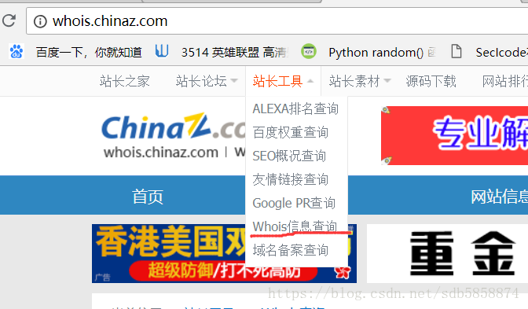

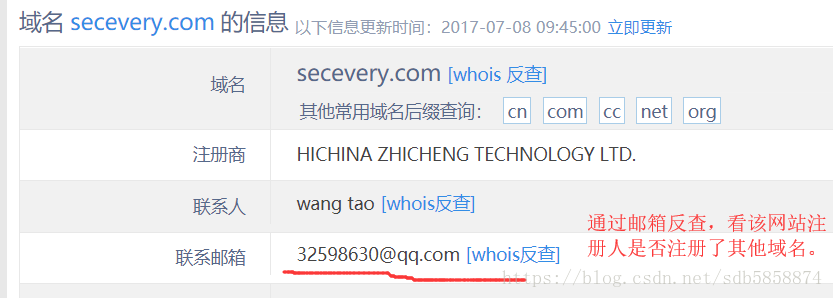

还可以在站长之家下面找到

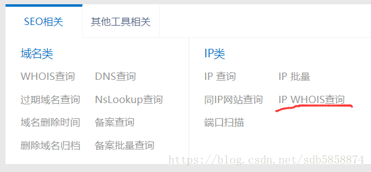

IP的 WHOIS查询，这样就获得了该网站的基本信息。

当然还有DNS历史解析记录 （可能是看服务器是否开启了域间传送策略）

旁站查询，兄弟域名查询

2.得到该网站的基本信息之后，我们再看看该域名下有那些主机（目前我使用的是子域名挖掘机）

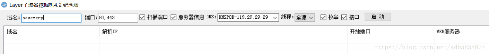

只需要将二级域名输入进去即可，然后默认扫描的是80端口(Web服务)，443端口(https服务)

我们只需要注意的是如果我们拿到的域名中带有,edu(教育)，gov(政府)等后缀，在进行子域名爆破的时候

请将edu,gov等后缀原封不动的带上。  如果我们将这些标示去掉，将严重影响我们的爆破成功率

例子：

[nyist.edu.cn/](http://www.nyist.edu.cn/)

进行挖掘时： [nyist.edu.cn/](http://www.nyist.edu.cn/)

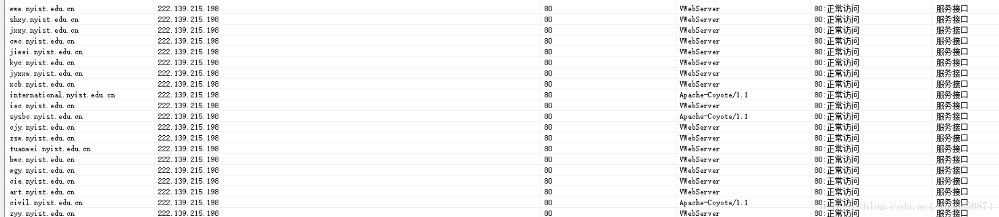

也可以右键点击页面空白处，选择导出全部

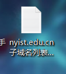

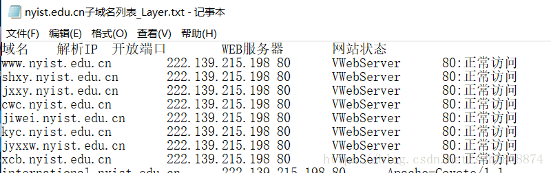

然后进行筛选

3.爆破出所有相关子域名后，我们将存活的子域名的IP过滤出来

然后使用Nmap扫描这些主机上开放了哪些端口。

具体命令

nmap -Pn -open -A -n -v -iL filename

-Pn：跳过主机发现，直接进行下面的操作

-n:不做DNS解析

-open：只显示开启的端口

-A：扫描过程中，输入回车，可以查看扫描进度

-v：显示详细信息

-F：快速扫描100个常见端口

-p:选择要扫描的端口 例： -p1-65535 （全端口扫描，中间没有空格）

-iL：为程序指定一个要扫描的IP列表

-sV：探测开放端口的服务和版本信息

-T可以选择扫描等级，默认T3，但想快点话，可以输入 -T4

扫描完端口之后，将这些存活主机的端口记录下来，并分别标注这些端口号代表什么服务，如果有条件的话再将服务器版本号记录上去

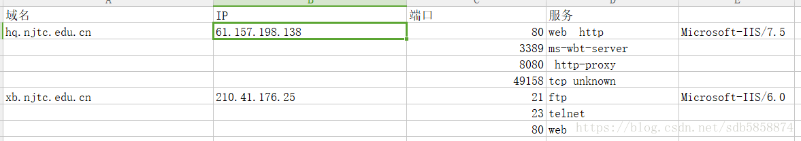

我们也可以打开命令行，使用telnet 远程连接服务器，查看服务器是否开启Telnet服务（默认23端口）

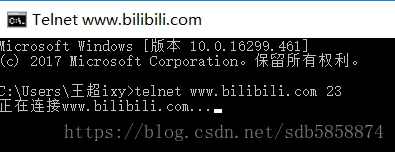

如果显示正在连接，则说明23端口已开启

如果端口关闭或无法连接会进行显示如下

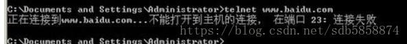

常见的几种端口有：

21：FTP远程文件传输端口

22：SSH，远程连接端口

3389端口：远程桌面连接

在发现这些端口只会我们可以尝试弱口令的爆破

这里推荐（hydra弱口令爆破工具）

6379端口：redis未授权访问GetShell

http://blog.knownsec.com/2015/11/analysis-of-redis-unauthorized-of-expolit/

该链接就是关于6379未授权访问的介绍

总结下来就是，hacker利用redis自带的config命令，可以进行写文件操作，然后攻击者将自己的公钥成功写入到目标服务器的/root/.ssh文件夹中的authotrized_keys文件中，然后攻击者就可以用自己对应的私钥登陆目标服务器。

这里可参考我之前的博客https://blog.csdn.net/sdb5858874/article/details/80484010

27017端口：mongodb默认未授权访问，直接控制数据库。

https://blog.csdn.net/u014153701/article/details/46762627

总结下就是：mongodb在刚刚安装完成时，默认数据库admin中一个用户都没有，在没有向该数据库中添加用户之前， Hacker可以通过默认端口无需密码登陆对数据库任意操作而且可以远程访问数据库！

9200/9300端口：elasticsearch远程命令执行

初学者对这个东西认识不深，感觉就是通过java映射的方法达到攻击目的，你们可以看看下面链接的分析

https://www.secpulse.com/archives/5047.html

80/8080/443端口：常见的Web服务漏洞，这里应该就是我们使用看家本领的地方了

基于常见的web漏洞进行扫描检测，或者对管理后台进行一次弱口令爆破

443端口：心脏出血漏洞（open ssl 1.0.1g 以前的版本）（老师说现在基本没有了。。）

自己的理解：攻击者不需要经过身份验证或者其他操作，就可以轻易的从目标机内存中偷来最多64kb的数据

这其中可能包含我们用来登陆的用户名密码,电子邮件密码，或重要的商务消息，下面是大牛的漏洞介绍

https://zhuanlan.zhihu.com/p/19722263?columnSlug=drops

还有一些

jboss弱口令

weblogic 天生SSRF漏洞

resin任意文件读取 

这些东西暂时不看吧，等日后知识储备更多了再了解（后续更细） 附上这些漏洞的分析博文

http://www.hack80.com/thread-22662-1-1.html

二、信息收集——中间件，脚本语言，数据库的识别

这里分享一下学长的经验 ：  常见的服务器搭配

linux + apache +php +mysql

linux +nginx +php +mysql

linux + tomcat +jsp + mysql/oracle

windows + iis + asp(x) +mysql

windows +iis + php +mysql

windows +apache +php +mysql

我们收集完这些信息之后可以去测试或者搜索对应的

中间件解析漏洞，404页面返回信息，http返回包

知道确切的数据库后，我们还可以去搜索该版本数据库存在哪些已知漏洞

三、信息收集——查看Web应用

1.首先识别下网站是否是CMS编写的

几种常见的CMS判别方法：

1.robots.txt文件

该文件的作用是告诉爬虫哪些目录是禁止爬取的。

在做CMS建站辨别时，我们可以通过robots.txt文件来判断出CMS的类型

由于还没有充分的实战经验，这里我就先引用其他技术人员的博客了

https://blog.csdn.net/qq1124794084/article/details/79218596

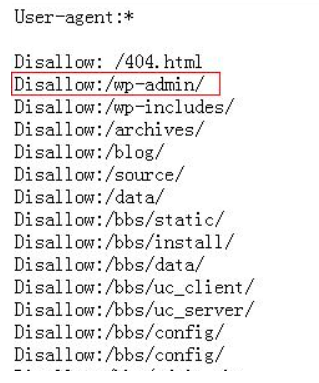

可以看到 robots.txt文件中 /wp-admin/ 路径可以看出该网站是WordPress的CMS建站

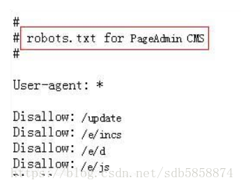

还有像这样，直接在注释中告诉我们，这是一个PageAdmin的CMS建站

当然有些robots.txt文件中的路径书写不是那么好辨认，这个时候我们可以直接把一些路径复制到百度去查询

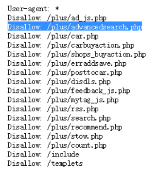

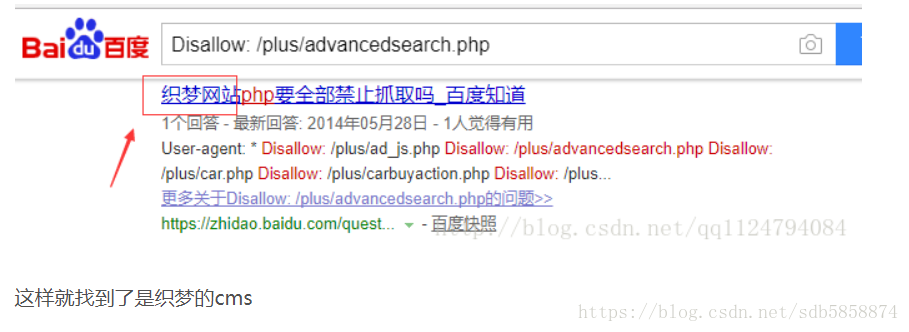

2.通过版权信息进行查询

查看办法：在网页的最底部

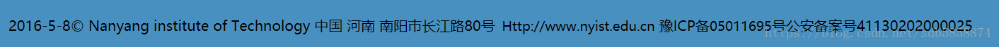

类似于这样，这些版权信息可能会告诉你，该网站是否为CMS建站

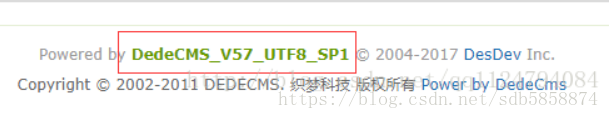

3.查看网页源代码： 

有些站点没有robot.txt，并且也把版本信息改了。

我们可以通过右键点开查看网页源码 是html里的注释

在其中的注释信息里找找看有没有作者遗漏的信息例如：

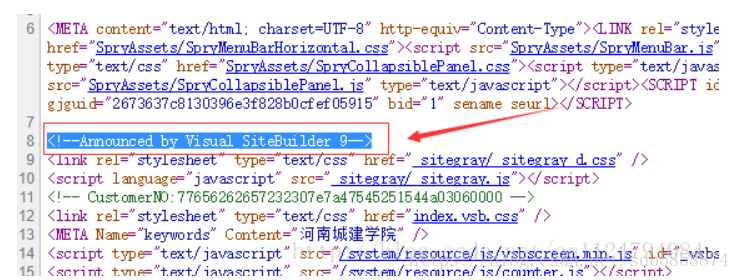

4.通过比较网站的MD5值

有些cms的扫描器就是用这个原理的，先收集某个cms的某个路径的文件的md5值，要求这个文件一般不会被使用者修改的。然后访问这个网站同样的路径下是否存在这个文件，存在的话比较md5值。相同能报出cms类型。这个比较考验字典的能力。

（没试过，不懂，有能力的可以自己尝试下）

5.查看后台管理页面上标

6.使用云悉指纹识别

http://www.yunsee.cn/

直接输入域名即可

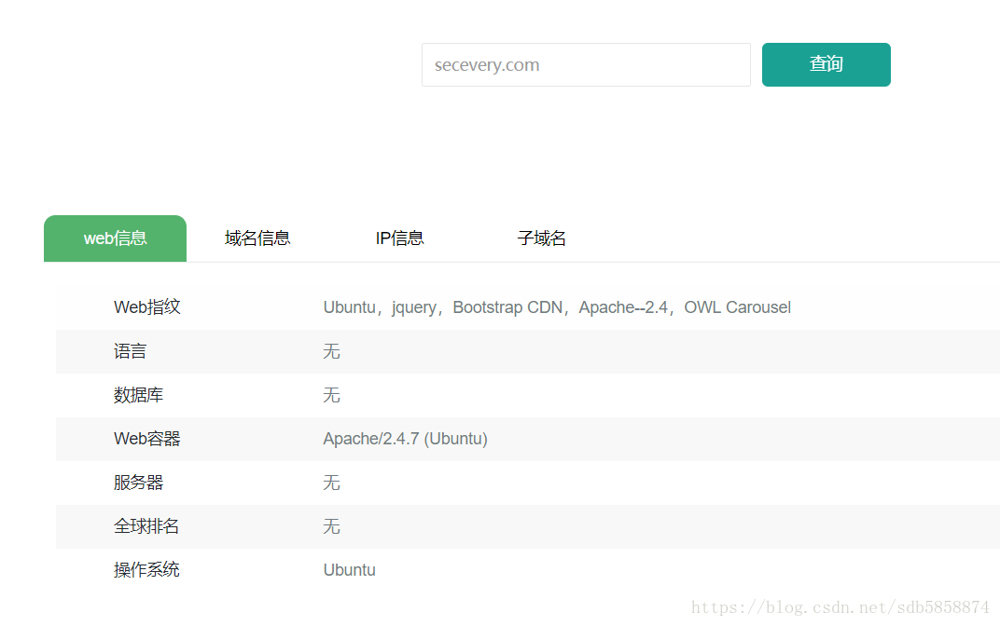

7.还可以使用工具：whatweb (这个主要是识别外国的CMS，国内CMS识别不是很叼)

（没用过，暂时不截图，后续跟进）

四、针对CMS建站的渗透思路

1.如果是开源的CMS 

直接百度,cms漏洞  在CMS漏洞库中寻求对应版本的漏洞

https://www.seebug.org/

2.如果该版本的CMS不存在漏洞，我们就对它进行敏感目录扫描，使用工具： 御剑，weakfilescan，DirBuster等

附上weakfilescan的下载地址

https://github.com/ring04h/weakfilescan

还有lijiejie的，BBSCAN的下载地址

https://github.com/lijiejie/BBScan

五、判别是否为开发框架建站

1.通过访问一个该不存在的页面

观察他的报错页面，比如404页面

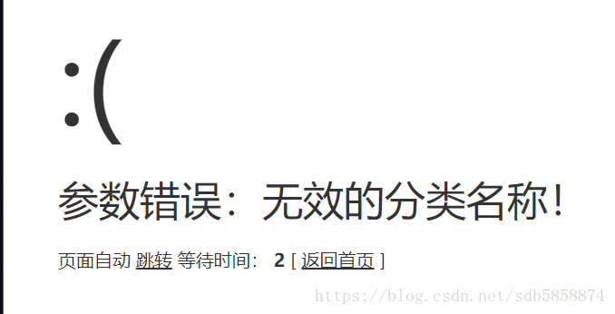

当你看到该哭脸时，证明这是一个thinkphp开发框架建立的站点。

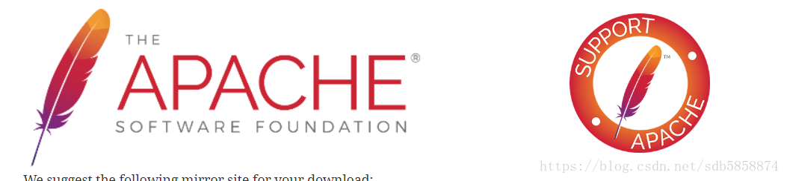

这个跟笔一样的图标就是stryct 2 开发框架特有的404返回标志

六、针对开发框架的渗透思路

1.针对thinkphp 有些版本可能存在远程代码执行，sql注入等漏洞

2.如果是stryct 2 开发框架，某别版本可能存在任意命令执行漏洞

  网上有 struct 2 命令执行漏洞利用工具

3.如果该开发框架不存在漏洞，则进行敏感目录文件扫描。

这里还是使用像刚刚提到的御剑等工具

七、针对个人开发网站的渗透思路

1.因为个人开发的网站也许有更大的可能存在各种漏洞，所以我们可以直接用扫描器去扫描漏洞

这里推荐使用：awvs，appscan等工具，然后查看扫描结果

2.手动测试，观察网站是否存在SQL注入，XSS盲打后台，上传漏洞，然后根据业务功能特点去测试

3.如果不存在漏洞，和之前的步骤一样，扫描目录，扫描敏感信息文件，爆破后台